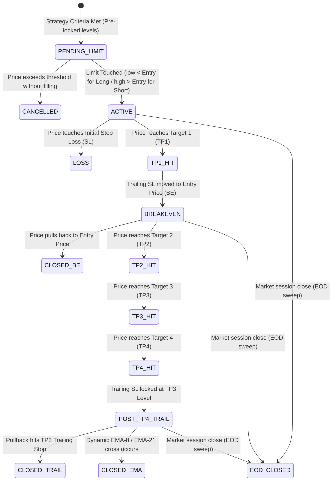

# 12 Canonical Strategy Triggers & Touch-Point Gating Architecture

> [!CAUTION]
> **Strict Verification Mandate & Touch-point Gating Rule**:
> - Long limit entries (`longAllowed` / `_buy`) MUST qualify strictly on **`low < H4`** (verifying that candle touch-point/wick penetrates below $H_4$).
> - Short limit entries (`shortAllowed` / `_sell`) MUST qualify strictly on **`high > L4`** (verifying that candle touch-point/wick penetrates above $L_4$).
> - **Gating must NEVER rely on `close` for limit qualification**.

---

## 1. The 12 Canonical Strategy Archetypes

```
┌───────────────────────────────────────────────────────────┐
│              12 CANONICAL STRATEGY SETUPS                 │
├─────────────────────────────┬─────────────────────────────┤
│         LONG SUITE          │         SHORT SUITE         │
├─────────────────────────────┼─────────────────────────────┤
│ 1. LONG MISSILE             │ 2. SHORT MISSILE            │
│ 3. LONG LIGHTNING           │ 4. SHORT LIGHTNING          │
│ 5. LONG SCALP               │ 6. SHORT SCALP              │
│ 7. LONG DIVERGENCE          │ 8. SHORT DIVERGENCE         │
│ 9. LONG HIDDEN DIVERGENCE   │ 10. SHORT HIDDEN DIVERGENCE │
│ 11. LONG EXTREME REVERSAL   │ 12. SHORT EXTREME REVERSAL  │
└─────────────────────────────┴─────────────────────────────┘
```

### 1. Missile Setups (`LONG MISSILE` / `SHORT MISSILE`)
- **Regime**: Breakout momentum beyond Camarilla $H_4 / L_4$.
- **Long Qualification**: 
  - Directional Bias confirmed.
  - Price wicks below $H_4$ (`low < H4`) to test liquidity before accelerating through $H_4$.
  - Stop Loss: Pre-defined near $H_3$. Targets: $H_5$ and expansion multiples.
- **Short Qualification**:
  - Price wicks above $L_4$ (`high > L4`) before falling through $L_4$.
  - Stop Loss: Pre-defined near $L_3$. Targets: $L_5$ and expansion multiples.

### 2. Lightning Setups (`LONG LIGHTNING` / `SHORT LIGHTNING`)
- **Regime**: Fast session-open directional expansion aligned with CPR bias.
- **Long Trigger**: Strong bullish opening print + positive slope on $\text{EMA}_8$ crossing $\text{EMA}_{21}$ with touch-point entry on $H_3 / H_4$.
- **Short Trigger**: Bearish opening print + negative slope on $\text{EMA}_8$ crossing $\text{EMA}_{21}$ with touch-point entry on $L_3 / L_4$.

### 3. Scalp Setups (`LONG SCALP` / `SHORT SCALP`)
- **Regime**: High-velocity mean reversion from value area extremes.
- **Long Scalp**: Responsive buying wick at Camarilla $L_3 / L_4$ inside a trading-range CPR day.
- **Short Scalp**: Responsive selling wick at Camarilla $H_3 / H_4$ inside a trading-range CPR day.

### 4. Divergence Setups (`LONG DIVERGENCE` / `SHORT DIVERGENCE`)
- **Regime**: Regular momentum exhaustion at structural boundaries.
- **Long**: Lower low in price with higher low in momentum oscillator (RSI / MACD / Stoch).
- **Short**: Higher high in price with lower high in momentum oscillator.

### 5. Hidden Divergence Setups (`LONG HIDDEN DIVERGENCE` / `SHORT HIDDEN DIVERGENCE`)
- **Regime**: Trend continuation pullbacks into institutional value.
- **Long**: Higher low in price with lower low in momentum oscillator (trend continuation).
- **Short**: Lower high in price with higher high in momentum oscillator.

### 6. Extreme Reversal Setups (`LONG EXTREME REVERSAL` / `SHORT EXTREME REVERSAL`)
- **Regime**: Severe multi-standard-deviation blow-off exhaustion.
- **Trigger**: Price pierces Camarilla $H_5$ or $L_5$ with an extreme reversal candlestick print (shooting star / hammer) and snaps back inside the bands.

---

## 2. Deterministic Trade Lifecycle State Machine



### Pre-Defined Structural Binding
- At signal genesis, all structural limit tiers (`entry_price`, `stop_loss`, `tp1`, `tp2`, `tp3`, `tp4`) are locked permanently into database columns.
- The engine NEVER generates dynamic guesses upon exit; exit prices are deterministically validated against the pre-locked tiers within a strict $\pm 0.2\%$ proximity window.
