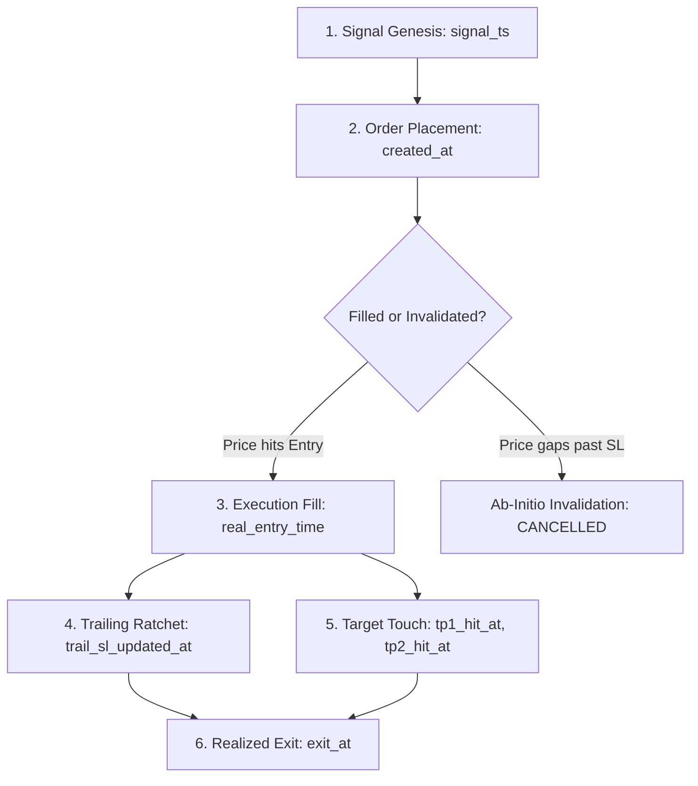

# Obsidian Architectural Documentation: September 24, 2026 (v4.0.1)
## Master Architecture: Trade Lifecycle Timestamping, Anti-Future Datestamp Mandate & Morning Session Protection

---

### 1. Executive Summary
This architectural specification establishes the strict mathematical and temporal foundation for trade state transitions across the platform.

Following the investigation of premature trade closures on GIFT NIFTY (`NIFTY1!`) and phantom losses on ab-initio invalidated limit orders (`DJI`), Version 4.0.1 standardizes **deterministic lifecycle timestamping** and eliminates all static time-of-day clock assumptions.

---

### 2. Core Architectural Principles

#### Principle 1: The Six Deterministic Lifecycle Milestones
Every trade processed by the deterministic engine must record verifiable timestamps at each stage of execution:


1. **Signal Genesis (`signal_ts`)**:
   - Webhook pipeline: Pine Script bar timestamp (`timenow`).
   - Black Box pipeline: 15-minute completed candle timestamp.
2. **Order Placement (`created_at`)**:
   - Supabase UTC timestamp when the limit order is persisted.
   - Status initialized to `OPEN` (or `ACTIVE LIMIT`).
3. **Execution Fill (`metadata.real_entry_time`)**:
   - Stamped when price reaches limit price and the order fills.
   - Transitions order from pending limit to `⚡ TRADE ACTIVE`.
4. **Dynamic Trailing Ratchet (`updated_at` / `metadata.trail_sl_updated_at`)**:
   - Stamped whenever a trailing stop is adjusted (e.g. moving SL to breakeven or locking in TP tiers).
5. **Target Touches (`metadata.tp1_hit_at`, `metadata.tp2_hit_at`, etc.)**:
   - Records the exact moment each TP level was achieved.
6. **Realized Exit (`exit_at` / `metadata.closeDate`)**:
   - Exact timestamp when the trade concluded.
   - Must strictly be `<= Date.now()`.

---

#### Principle 2: Zero Future Timestamps Rule
* **Mandate**: An exit timestamp (`exit_at`) or update timestamp must **NEVER** exceed the current wall-clock time (`Date.now()`).
* **Enforcement**: In `cron-eod-close.js`, any session close timestamp calculated for today is verified:
  ```javascript
  if (!isNaN(closeDate.getTime()) && closeDate.getTime() <= Date.now()) {
      return closeDate.toISOString();
  }
  return new Date().toISOString(); // Capped strictly at current time
  ```

---

#### Principle 3: Early Morning Session & GIFT NIFTY Protection
* **GIFT NIFTY Market Hours**: `NIFTY1!` continuous futures trade from **06:30 AM to 02:45 AM IST**.
* **Protection Logic**: Background EOD sweeps must never assume trades created before 09:00 AM IST are stale leftovers from yesterday.
* **Verification Check**:
  ```javascript
  const istCreated = new Date(createdDate.toLocaleString("en-US", { timeZone: "Asia/Kolkata" }));
  const isCreatedToday = !isNaN(istCreated.getTime()) && (
      istCreated.getFullYear() === istTime.getFullYear() &&
      istCreated.getMonth() === istTime.getMonth() &&
      istCreated.getDate() === istTime.getDate()
  );

  if (niftySymbols.includes(sym)) {
      if (isCreatedToday) {
          return istHours >= 15.5; // Only close AFTER 15:30 IST
      }
      if (hoursAgo > 8 || istHours >= 15.5) return true;
  }
  ```

---

#### Principle 4: Ab-Initio Limit Invalidation Filtering
* **The Problem**: A limit order is placed, but on the next bar price immediately opens beyond the stop loss without an execution fill. Pine Script's bar-replay engine evaluates `high >= entry` and `high >= sl` in the same step, incorrectly emitting `"Hit Initial SL"` instead of `"Cancelled"`.
* **The Solution**: Ghost trades with no active fill confirmation (`!real_entry_time` / 0 hold duration) that stop out at inception are recognized as **Invalidated Ab-Initio** and purged under the ghost-trade cleanup rule, safeguarding win rate denominators.

---

### 3. File & Repository Summary

| Component | File Path | Version | Changes Applied |
|---|---|---|---|
| **EOD Cron Engine** | `TLCS_Website_Deploy/netlify/functions/cron-eod-close.js` | `v4.0.1` | Fixed morning trade EOD sweep bug; added anti-future timestamp cap |
| **System Rules** | `.agents/AGENTS.md` | `v4.0.1` | Codified Lifecycle Timestamping & Ab-Initio Invalidation mandates |
| **Obsidian Logs** | `Obsidian_Update_Log_Sept24_v4_0_1_...` | `v4.0.1` | Operational update log for September 24 incident |
| **Obsidian Docs** | `Obsidian/08_Trade_Lifecycle_Timestamping_...` | `v4.0.1` | Master architectural documentation |
