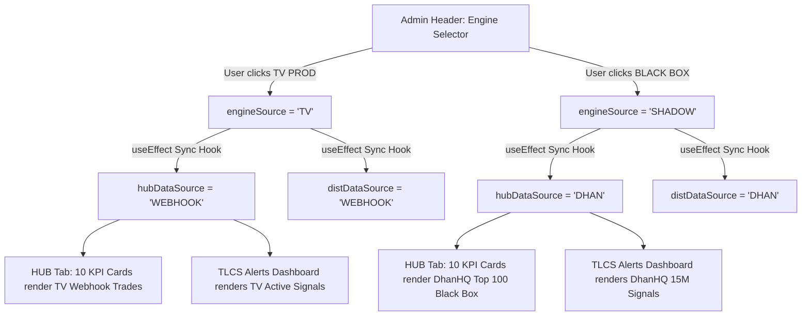

# Obsidian Architectural Documentation: September 24, 2026 (v4.0)
## Master Architecture: DhanHQ Autonomous Simulation Engine & UI Source Synchronization

---

### 1. Executive Summary
This architectural baseline standardizes **Platform Version 4.0** across all web, mobile, backend, and quantitative algorithmic systems.

Key operational milestones delivered:
1. **Complete Bidirectional UI State Synchronization**: Fixed the state decoupling between the Stage 4 Engine Selector (`TV PROD` vs `BLACK BOX`) and the HUB/LOGS data source selectors (`hubDataSource` and `distDataSource`). Toggling `TV PROD` immediately switches all HUB metrics, Alert Dashboards, and parameter matrices to TradingView production data, eliminating the `0 trades` display issue.
2. **DhanHQ API Integration in Safe Simulation Mode**: Integrated active DhanHQ API credentials (`DHAN_CLIENT_ID: 1100428069`) with strict enforcement of `DHAN_SIMULATION_MODE=true` and `PAPER_TRADING=True` to guarantee **zero financial risk** and zero live order placement.
3. **Dynamic Active MCX Contract Binding**: Automated resolution of active near-month MCX commodity futures (`CRUDEOIL: 569900`, `GOLD: 483079`, `SILVER: 495214`, `NATURALGAS: 568245`) via Dhan Scrip Master.
4. **Resilient Real-Time LTP Market Data Feed**: Enhanced the Dhan market feed parser in Next.js (`lib/dhan.ts`) to handle integer security IDs and nested payload dictionaries.

---

### 2. UI Source Synchronization Architecture



#### Root Cause Analysis of Previous State Desynchronization
* **Problem**: In previous iterations, `engineSource` (TV vs SHADOW) was managed independently from `hubDataSource` (WEBHOOK vs DHAN). When a user clicked `TV PROD` at the top, the header button highlighted in amber, but `hubDataSource` remained stuck on `DHAN` (Standalone 15m Mini-Project).
* **Consequence**: The HUB tab displayed `ALL 0`, `ACTIVE LIMITS: 0`, `LIVE TRADES: 0`, `CLOSED TRADES: 0` because the offline NSE scanner had not generated shadow signals for today, even though 12 live production trades existed in the `signals` table.
* **Permanent Fix**: Implemented a reactive `useEffect` hook in `page.tsx` ensuring that `hubDataSource` and `distDataSource` always mirror `engineSource` in strict lockstep, and vice versa.

---

### 3. DhanHQ Safe Simulation Architecture (Zero Live Capital Risk)

```
┌─────────────────────────────────────────────────────────────────┐
│ Trading Signal Generated (TradingView Webhook or Local Scanner) │
└───────────────────────────────┬─────────────────────────────────┘
                                │
                                ▼
┌─────────────────────────────────────────────────────────────────┐
│ Safety Gate Check (DHAN_SIMULATION_MODE === true)               │
│ • Tv-Alert-Mobile/src/lib/dhan.ts: DHAN_SIMULATION_MODE=true    │
│ • algo_engine/dhan_executor.py: PAPER_TRADING=True              │
└───────────────────────────────┬─────────────────────────────────┘
                                │
                ┌───────────────┴───────────────┐
                ▼                               ▼
    [Live API Call Skipped]         [Live Market Data Query]
    • Generates SIM_XXXXXX          • Queries /marketfeed/ltp
    • Records virtual entry @ LTP   • Verifies real-time bid/ask
    • Injects trade to Supabase     • Mathematical lifecycle tracking
```

#### Safety Constraints
* **`DHAN_SIMULATION_MODE=true`**: Enforced in `Tv-Alert-Mobile/.env.local` and Netlify environment variables.
* **`PAPER_TRADING=True`**: Enforced in `algo_engine/.env`.
* Under no circumstances is a live order sent to the broker. All order IDs are prefixed with `SIM_` and tracked virtually against real-time market data.

---

### 4. Dynamic Contract Resolution for MCX Commodities
Contract security IDs on MCX expire monthly/quarterly. Statically hardcoded IDs become obsolete. The platform resolves current active contracts dynamically from Dhan's Scrip Master (`api-scrip-master.csv`):

| Asset | Commodity Symbol | Current Active Security ID | Active Contract Expiry | Lot Size |
| :--- | :--- | :--- | :--- | :--- |
| **Crude Oil** | `CRUDEOIL` | `569900` | 19-Oct-2026 23:30 IST | 100 |
| **Gold** | `GOLD` | `483079` | 05-Oct-2026 23:30 IST | 1 |
| **Silver** | `SILVER` | `495214` | 04-Dec-2026 23:30 IST | 30 |
| **Natural Gas** | `NATURALGAS` | `568245` | 25-Sep-2026 23:30 IST | 1250 |

---

### 5. Deployment & Verification Baseline
* **Version Standard**: `v4.0` / `4.0.0`
* **Mobile Terminal Header**: `TLCS TERMINAL v4.0`
* **SIEM Init Log**: `Terminal V4.0 initialized`
* **Daemon Status Pill**: `Active Daemon v4.0`
* **Live LTP Verification**: Verified live ticks via Dhan API for TCS (₹2,087), Crude Oil (₹9,271), and Gold (₹1,50,439).
* **Next.js Production Build**: Passed with 0 TypeScript errors and 0 lint warnings across all 8 static and dynamic routes.
