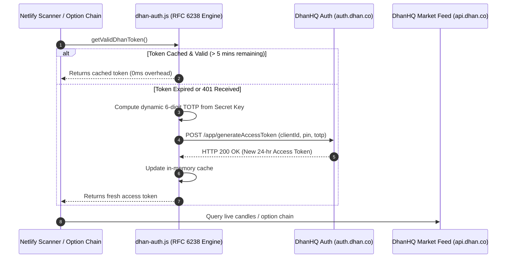

# Obsidian Architectural Documentation: September 25, 2026 (v5.0)
## Master Architecture: Autonomous Zero-Touch DhanHQ Engine, Live Option Chain & Intraday Performance Trajectory

---

### 1. Executive Summary & Version 5.0 Golden Baseline
This document formally ratifies the architectural upgrades establishing **Platform Version 5.0**:
1. **Autonomous Zero-Touch DhanHQ Token Engine (RFC 6238 TOTP Handshake)**: Programmatic generation and auto-renewal of 24-hour DhanHQ access tokens on the fly using Client ID, 6-digit Dhan PIN, and Base32 TOTP Secret Key (`N5ZUIALJCBGJ63YS2DUB3BLW7EEPBJU2`), completely eliminating manual daily logins and environment variable updates.
2. **401 Self-Healing Auto-Retry Layer**: Dynamic detection of expired tokens or authorization failures in Netlify background functions (`dhan-scanner-background.js`, `dhan-option-chain.js`), forcing on-demand TOTP regeneration and transparent request retry.
3. **Live Real-Time Option Chain on HUB Tab**: Integrated directly beneath `TLCS ALERTS DASHBOARD` on the mobile terminal (`Tv-Alert-Mobile/src/app/page.tsx`), supporting `NIFTY 50`, `CRUDE OIL`, `NATURAL GAS`, `GOLD`, and `SILVER` strictly locked to **current expiry only**.
4. **Intraday SVG Equity Trajectory Curves**: Injected into the System-Wide Performance Grid, Consolidated Market-Wide Performance Table, and Today's Signal Performance Table with live crosshairs, high-watermarks, and max drawdowns.
5. **Dual-Session Black Box Market Coverage**: Full automated scanning of NSE Equities (`09:15-15:30 IST`, entry cutoff `14:00 IST`) and MCX Commodities (`09:00-23:30 IST`, entry cutoff `22:00 IST`) with full Pine Script post-TP4 exit hierarchy parity (`Hit EMA`, `Hit TP3 Trailing`, `EOD Exit`, `Hit Initial SL`).

---

### 2. Autonomous Zero-Touch DhanHQ Authentication Architecture

#### The Problem Solved
Historically, DhanHQ personal developer access tokens had a strict 24-hour time-to-live (`exp`), requiring manual daily login to `web.dhan.co`, generating a new access token, and updating deployment variables. Missing this daily cycle caused silent 401 failures across all background scanners and live market feeds.

#### The Zero-Touch TOTP Solution
DhanHQ supports programmatic token generation via `https://auth.dhan.co/app/generateAccessToken` when TOTP authentication is configured on the account.



#### Cryptographic TOTP Engine Specifications
Implemented with zero external npm dependencies using Node.js built-in `crypto`:
```javascript
function generateTOTP(secretBase32 = DHAN_TOTP_SECRET) {
    const base32chars = 'ABCDEFGHIJKLMNOPQRSTUVWXYZ234567';
    let bits = '';
    const cleanSecret = secretBase32.replace(/[\s-]/g, '').toUpperCase();
    for (let i = 0; i < cleanSecret.length; i++) {
        const val = base32chars.indexOf(cleanSecret.charAt(i));
        if (val >= 0) bits += val.toString(2).padStart(5, '0');
    }
    const bytes = [];
    for (let i = 0; i + 8 <= bits.length; i += 8) {
        bytes.push(parseInt(bits.substring(i, i + 8), 2));
    }
    const key = Buffer.from(bytes);
    const epoch = Math.floor(Date.now() / 1000);
    const counter = Math.floor(epoch / 30);
    const buf = Buffer.alloc(8);
    buf.writeBigInt64BE(BigInt(counter));

    const hmac = crypto.createHmac('sha1', key).update(buf).digest();
    const offset = hmac[hmac.length - 1] & 0x0f;
    const code = ((hmac[offset] & 0x7f) << 24 | (hmac[offset + 1] & 0xff) << 16 | (hmac[offset + 2] & 0xff) << 8 | (hmac[offset + 3] & 0xff)) % 1000000;
    return String(code).padStart(6, '0');
}
```

#### Deployed Auth Modules:
* **Netlify Serverless**: `TLCS_Website_Deploy/netlify/functions/dhan-auth.js`
* **Python Algo Engine**: `algo_engine/dhan_auth.py`
* **Credentials Bound**:
  * `DHAN_CLIENT_ID`: `1100428069`
  * `DHAN_PIN`: `871346`
  * `DHAN_TOTP_SECRET`: `N5ZUIALJCBGJ63YS2DUB3BLW7EEPBJU2`

---

### 3. Real-Time Live Option Chain on HUB Tab

#### User Experience & Asset Coverage
Positioned directly beneath `TLCS ALERTS DASHBOARD` on the **HUB** tab (`Tv-Alert-Mobile/src/app/page.tsx`):
* **Supported Assets**:
  * `NIFTY 50` (NSE Index: Underlying Scrip `13`, Segment `IDX_I`, Strike Step `50`)
  * `CRUDE OIL` (MCX Commodity: Underlying Scrip `569900`, Segment `MCX_COMM`, Strike Step `50`)
  * `NATURAL GAS` (MCX Commodity: Underlying Scrip `568245`, Segment `MCX_COMM`, Strike Step `5`)
  * `GOLD` (MCX Commodity: Underlying Scrip `483079`, Segment `MCX_COMM`, Strike Step `200`)
  * `SILVER` (MCX Commodity: Underlying Scrip `495214`, Segment `MCX_COMM`, Strike Step `500`)
* **Strict Rule**: Option chains are locked strictly to **current expiry only** (`currentExpiry`). Past or distant month contracts are filtered out.
* **Key Visual Indicators**:
  * ATM Strike spotlight badge with current underlying spot price.
  * Real-time Put-Call Ratio (PCR) with sentiment badge (`BULLISH` if PCR > 1.0, `BEARISH` if PCR < 1.0).
  * Max Pain Strike level with distance calculation.
  * Total Call Open Interest vs Total Put Open Interest progress ratio.

---

### 4. Consolidated & Market-Wise Intraday Equity Curves

#### Visual Analytics Integration
Rendered via dynamic SVG component `PerformanceEquityCurve`:
1. **System-Wide Performance Grid**: Embedded into the consolidated performance overview.
2. **Market-Wise Performance Grid**: Rendered on each market tab (`NSE`, `MCX`, `NYMEX`, `CRYPTO`, `FOREX`, `WORLD`).
3. **Today's Signal Performance Table**: Embedded directly into the sticky consolidated header row (`∑ CONSOLIDATED INTRADAY TRAJECTORY`).

#### Technical Features:
* Dynamic SVG polyline with responsive bounding box (`0 0 width height`).
* Dotted zero baseline ($0.00\%$) dividing positive and negative trajectory territory.
* High-watermark dashed green reference line tracking intraday peak returns.
* Maximum drawdown visual indicator.
* Interactive pointer crosshairs displaying trade index, trade symbol, and exact cumulative return percentage.

---

### 5. Table Isolation & Parity Audit Architecture

```
┌───────────────────────────────────────────────────────────┐
│               TLCS VERSION 5.0 SIGNAL ROUTING             │
└───────────────────────────────────────────────────────────┘
              │                               │
              ▼                               ▼
┌───────────────────────────┐   ┌───────────────────────────┐
│   TRADINGVIEW WEBHOOKS    │   │  DHANHQ BLACK BOX SCANNER │
│   (Live Strategy Engine)  │   │   (Autonomous 15m Engine) │
└─────────────┬─────────────┘   └─────────────┬─────────────┘
              │                               │
              ▼                               ▼
   Supabase: `signals`             Supabase: `shadow_signals`
              │                               │
              ▼                               ▼
   Default Mobile View             `SHADOW` / `PARITY` View
   Web `scanner.html`              Side-by-Side Audit Terminal
```

* **Strict Safety Separation**: TradingView live webhooks write exclusively to `signals`; the DhanHQ Black Box scanner writes exclusively to `shadow_signals`.
* **Zero Pollution**: TradingView live statistics and public web scanners are protected from unverified algorithmic setups until production promotion.

---

### 6. Platform Version 5.0 Branding Baseline
* **Mobile Terminal Header**: `TLCS TERMINAL v5.0`
* **SIEM Initialization Log**: `Terminal V5.0 initialized`
* **Daemon Status Indicator**: `Active Daemon v5.0`
* **Package Versions**: Standardized to `5.0.0` across all repositories (`Tv-Alert-Mobile`, `TLCS_Website_Deploy`, root workspace).
