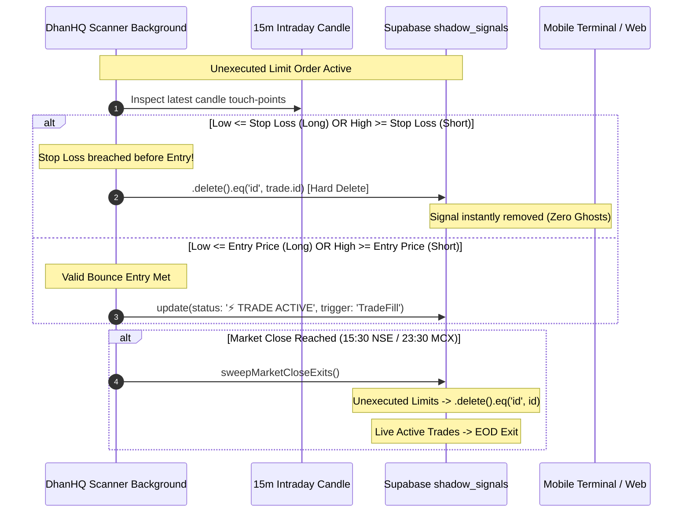

# Obsidian Architectural Documentation: September 30, 2026 (v5.0)
## Master Architecture: DhanHQ Black Box Master Pine Script Engine Alignment & Zero-Ghost Invalidation Parity

---

### 1. Executive Summary & Version 5.0 Milestone Context
This document formally ratifies the complete architectural alignment of the autonomous DhanHQ Black Box trading engine with the production **TLCS PivotBoss Indicator v6.0** (3,539 lines of Pine Script).

Prior to this upgrade, while the serverless scanner executed autonomous trades, certain mathematical indicators and pivot profiles relied on simplified approximations. With this release:
1. **Master Pine Script Mathematical Parity**: The serverless background scanner (`dhan-scanner-background.js`) mirrors every single calculation step from the master indicator codebase: Dual CPR (Today & Yesterday), Normalized NCPR width (< 5.0%), TPO 68% Value Area histogram profile (VAH, VAL, POC), Institutional Bias (`c1`), Opening Bias (`dX`), Day Type (`mX`), and Webhook Zone (`z1`).
2. **Indicator Subsystems Alignment**: Dual Exponential Moving Averages (DEMA 5 and 13 on $(H+L+C)/3$), 14-period DMI (+DI / -DI), 92-bar normalized momentum oscillator ($m0$ and $m10$), 15-swing dynamic Support/Resistance extraction, and Wick Reversal / Extreme Reversal (L02) systems.
3. **Decoupled 6-Strategy Trigger Hierarchy**: Strict priority evaluation for `Lightning`, `Extreme Reversal`, `Divergence`, `Hidden Divergence`, `Missile Breakout`, and `Scalp` with canonical H4/L4 limit touch-point gating (`low < H4` for Long, `high > L4` for Short).
4. **Session Midpoint Limit Pricing**: Pending limit orders are placed deterministically at `trendLine = (highestHigh + lowestLow) / 2.0` derived from active session intraday candles, paired with ATR multipliers ($0.75, 2.5, 4.0, 6.5, 8.0$).
5. **Zero-Ghost Parity Mandate**: Unexecuted limit orders whose stop-loss is breached before entry, or that remain unexecuted at market close, are permanently hard-deleted (`.delete().eq('id', trade.id)`) from `shadow_signals`, mirroring the TradingView signal invalidation policy and completely eliminating ghost signals from terminal feeds.

---

### 2. Dual CPR, Normalized NCPR & TPO 68% Value Area Profile

#### Dual Central Pivot Range (Today & Yesterday)
Extracted using historical daily bars (D-1 for Today's CPR, D-2 for Yesterday's CPR):
$$\text{DP} = \frac{H_{d1} + L_{d1} + C_{d1}}{3}, \quad \text{Bcy} = \frac{H_{d1} + L_{d1}}{2}, \quad \text{Tcy} = 2 \cdot \text{DP} - \text{Bcy}$$
$$\text{DTc} = \max(\text{Tcy}, \text{Bcy}), \quad \text{DBc} = \min(\text{Tcy}, \text{Bcy})$$
$$\text{YP} = \frac{H_{d2} + L_{d2} + C_{d2}}{3}, \quad \text{BcY} = \frac{H_{d2} + L_{d2}}{2}, \quad \text{TcY} = 2 \cdot \text{YP} - \text{BcY}$$
$$\text{YTc} = \max(\text{TcY}, \text{BcY}), \quad \text{YBc} = \min(\text{TcY}, \text{BcY})$$

#### Normalized Central Pivot Range (NCPR)
Evaluates whether CPR is exceptionally narrow, priming the asset for a high-volatility trend expansion:
$$\text{NCPR (\%)} = \left(\frac{|\text{DTc} - \text{DBc}|}{H_{d1} - L_{d1}}\right) \times 100 < 5.0\%$$

#### TPO 68% Value Area Histogram Profile
Calculated across previous session 15-minute intraday candles:
* Intraday range: $\text{sessionRange} = \text{sessionHigh} - \text{sessionLow}$.
* Discretized into 20 equal-interval bins ($\text{sectionRange} = \text{sessionRange} / 20$).
* Frequency count of candle closes falling into each bin determines the Point of Control ($\text{POC}$).
* Symmetrical expansion outward from $\text{POC}$ until $\sum \text{frequency} \ge 68\%$ of total TPO sum yields $\text{VAH}$ (Value Area High) and $\text{VAL}$ (Value Area Low).

---

### 3. Market Profile States, Biases & Day Types

```mermaid
graph TD
    A[Open & Close Prices] --> B[Opening Bias dX]
    A --> C[Institutional Bias c1]
    A --> D[Day Type mX]
    
    B --> E[Market Profile Range State]
    E -->|OO in [VAL, VAH]| F[IN RANGE IN VALUE]
    E -->|OO out of [VAL, VAH]| G[IN RANGE OUT OF VALUE]
    E -->|OO out of [DL, DH]| H[OUT OF RANGE OUT OF VALUE]

    C --> I{CPR Position}
    I -->|Inside CPR| J[WATCH]
    I -->|Confirmed Bullish & > DTc| K[CONFIRMED BULLISH]
    I -->|Confirmed Bearish & < DBc| L[CONFIRMED BEARISH]
    I -->|Failed Outside| M[REJECTION]

    D --> N{Sideways vs Trend Filter}
    N -->|Typical / Sideways / Range| O[isSidewaysDay = true]
    N -->|Big Move / Trend / NCPR| P[dayAllowed = true]
```

#### Bias & Day Type Classifications:
* **Opening Bias (`dX`)**:
  - `IN RANGE IN VALUE`: Open within previous day range and within previous day Value Area ($VAL < OO < VAH$).
  - `IN RANGE OUT OF VALUE`: Open within previous day range but outside Value Area.
  - `OUT OF RANGE OUT OF VALUE`: Open outside previous day High/Low and outside Value Area.
  - Directional fallbacks: `BULLISH` ($DTc > YTc \land DBc > YTc$) or `BEARISH` ($DTc < YBc \land DBc < YBc$).
* **Institutional Bias (`c1`)**:
  - `WATCH`: Price fluctuating inside CPR ($DBc < close < DTc$).
  - `CONFIRMED BULLISH`: Bullish orientation and $close > DTc$.
  - `CONFIRMED BEARISH`: Bearish orientation and $close < DBc$.
  - `REJECTION`: Bullish/Bearish orientation failing back across opposite CPR boundary.
  - `SIDEWAYS` / `SIDEWAYS/ BREAKOUT` / `BREAKOUT`.
* **Day Type (`mX`)**:
  - `TYPICAL DAY, TRADING RANGE, SIDEWAYS`
  - `BIG MOVE`
  - `TREND DAY, DOUBLE DISTRIBUTION TREND, EXPANDED TYPICAL`
  - `TREND DAY, DOUBLE DISTRIBUTION TREND`
* **Filter Rules**:
  - `isSidewaysDay`: Flags sideways/range environments.
  - `dayAllowed`: Standard trend/breakout strategies require `!isSidewaysDay || NCPR`. Divergence strategies are explicitly exempt from `dayAllowed`.

---

### 4. Technical Indicators & Pattern Verification

#### Pivot DEMA 5 and DEMA 13
Calculated on Typical Price $fPivots = (H + L + C) / 3$:
$$\text{EMA}_1 = \text{EMA}(fPivots, N), \quad \text{EMA}_2 = \text{EMA}(\text{EMA}_1, N), \quad \text{PDEMA} = 2 \cdot \text{EMA}_1 - \text{EMA}_2$$
$$\text{fPivotPDEMA} = \text{EMA}(\text{PDEMA}, N) \quad \text{for } N \in \{5, 13\}$$

#### Dynamic S/R Swings & Bounces
* Extracts up to 15 recent pivot highs and 15 pivot lows ($L=10$ lookback).
* Merges dynamic pivot levels with Camarilla ($H3, H4, L3, L4$), CPR ($DTc, DBc$), and Value Area ($VAH, VAL$).
* Validates candle touch-point bounces:
  - **`isValidBounceUp`**: $\text{low} \le \text{level} \land \text{open} \ge \text{level} \land \text{high} > \text{level} \land \text{close} > \text{level} \land \text{close} > \text{open}$.
  - **`isValidBounceDown`**: $\text{high} \ge \text{level} \land \text{open} \le \text{level} \land \text{low} < \text{level} \land \text{close} < \text{level} \land \text{close} < \text{open}$.

#### Extreme Reversal System (L02)
* Previous candle range $\text{prevRange} > 2.0 \times \text{SMA}(\text{candleSize}, 50)$.
* Previous candle body $\text{prevBody} \ge 0.75 \times \text{prevRange}$ and $\text{prevBody} > \text{SMA}(\text{bodySize}, 50)$.
* Current candle closes opposite to previous candle ($\text{close} > \text{open}$ for Bullish, $\text{open} > \text{close}$ for Bearish).
* Gated by DEMA slope: `pDemaSlope.rising` for Long, `pDemaSlope.falling` for Short.

#### CPR Divergence & Hidden Divergence
* Regular Divergence: Price makes lower low (higher high) while 92-bar normalized momentum oscillator makes higher low (lower high).
* Hidden Divergence: Bar[1] pulls back inside the CPR while momentum confirms continuation, confirmed on current bar close.

---

### 5. Strategy Ladder, Order Execution & Limit Pricing

#### Strategy Priority Dispatch
```text
1. LIGHTNING           (CanBuy && ScalpBuy) && longAllowed && dayAllowed
2. EXTREME REVERSAL    Elongsignal && longAllowed && dayAllowed
3. DIVERGENCE          (regBullDiv && GrS) && longAllowed [Exempt from dayAllowed]
4. HIDDEN DIVERGENCE   (hiddenBullishConfirmed && GrS) && longAllowed [Exempt from dayAllowed]
5. MISSILE BREAKOUT    CanBuy && !HigherPriority && longAllowed && dayAllowed
6. SCALP               ScalpBuy && !HigherPriority && longAllowed && dayAllowed
```

#### Deterministic Limit Levels
* **Touch-point Gating**:
  - Long: **`low < H4`**
  - Short: **`high > L4`**
* **Entry**: Session midpoint `trendLine = (highestHigh + lowestLow) / 2.0`.
* **Risk & Reward Grid (ATR 14 Multipliers)**:
  - Stop Loss: $\text{Entry} \mp 0.75 \times \text{ATR}$
  - Target 1 (TP1): $\text{Entry} \pm 2.5 \times \text{ATR}$
  - Target 2 (TP2): $\text{Entry} \pm 4.0 \times \text{ATR}$
  - Target 3 (TP3): $\text{Entry} \pm 6.5 \times \text{ATR}$
  - Target 4 (TP4): $\text{Entry} \pm 8.0 \times \text{ATR}$

---

### 6. Zero-Ghost Invalidation Mandate



#### Operational Guarantees:
1. **Invalidated Limits**: Evaluated prior to entry fill checks. If candle wicks breach the stop-loss level, `.delete().eq('id', trade.id)` is called immediately.
2. **Session Close Sweeps**: At 15:30 IST (NSE) and 23:30 IST (MCX), `sweepMarketCloseExits` and `cron-eod-close.js` permanently hard-delete unexecuted limit orders from `shadow_signals`.
3. **No Phantom Fills**: A candle opening beyond stop loss or dropping straight through entry to SL is purged instantly without generating false executions.

---

### 7. Verification & Deployment Record
* **Mathematical Test Suite**: `scratch/test_dhan_math_engine.js` passed all 12 test assertions with zero discrepancies.
* **Algo Engine Unit Tests**: All 87 unit tests passed in `algo_engine/` (`pytest tests/`).
* **Serverless Functions Syntax**: `TLCS_Website_Deploy/netlify/functions/dhan-scanner-background.js` and `cron-eod-close.js` compiled and verified with Node.js v20.
* **Git Commit**: `186ec27` committed to `TLCS_Website_Deploy` and deployed to production.
