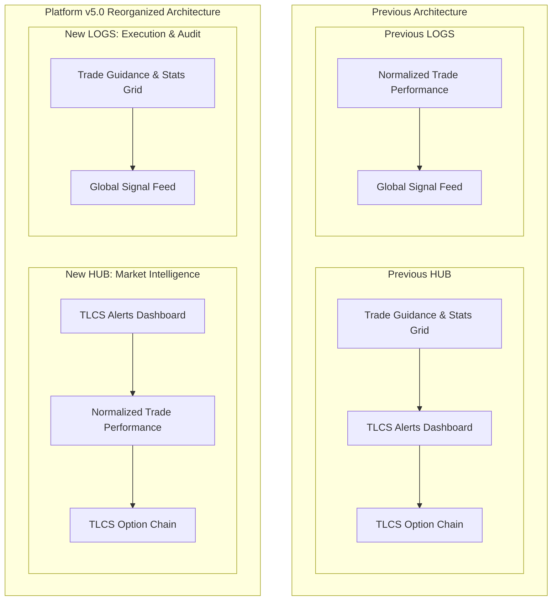

# Obsidian Architectural Documentation: October 1, 2026 (v5.0)
## Master Architecture: Terminal Screen Information Architecture & Operational Layout Reorganization (HUB & LOGS Tabs)

---

### 1. Executive Summary & Milestone Context
* **Platform Baseline**: Version `v5.0` / `5.0.0`
* **Release Date**: October 1, 2026
* **Target Repositories & Subsystems**:
  - `Tv-Alert-Mobile/` (`src/app/page.tsx`)
  - Platform Documentation: `.agents/AGENTS.md`
  - Knowledge Base: `Obsidian/`
* **Operational Goal**:
  Restructure the visual flow across the mobile terminal's primary interactive tabs (**HUB** and **LOGS**) to align operational intelligence with immediate trader utility:
  1. **HUB Tab (Market Intelligence Center)**:
     - **Top**: `TLCS ALERTS DASHBOARD` (Parameter Matrix: Missile, Scalp, Lightning, Extreme Reversal, Divergence, Hidden Divergence, Blueprints, Sequences).
     - **Middle**: `NORMALIZED TRADE PERFORMANCE` (P&L per trade distribution, asymmetric frequency bell curve histogram, interactive trade inspector, and 8 institutional KPIs).
     - **Bottom**: `TLCS LIVE OPTION CHAIN` (Strict current expiry ATM, PCR, and Max Pain strike intelligence).
  2. **LOGS Tab (Execution & Audit Center)**:
     - **Top**: `TRADE GUIDANCE` (Operational status, Novice Mode switch, Matches pill, Data Source toggle `WEBHOOK` vs `DHANHQ 100`, Standalone DhanHQ filters, and the 2-row performance metrics grid).
     - **Bottom**: `GLOBAL SIGNAL FEED` (Consolidated execution audit log with live trailing stops, target completions, search, and market filters).

---

### 2. Tab Information Architecture Comparison

---

### 3. Detailed Component Specifications

#### A. HUB Tab (`activeTab === 'DASHBOARD'`)
1. **Uniform Tab Header**:
   - Icon: `LayoutGrid`
   - Title: `Hub` | Badge: `Execution Edge`
2. **Main Section Header**:
   - Title: `TLCS AI (ALERTS INTELLIGENCE) - TLCS ALERTS DASHBOARD`
   - Icon: `SlidersHorizontal` (accent colored, `size={22}`)
   - Subtitle: Dynamic based on source (`TradingView Webhook Engine` or `Standalone DhanHQ 15m Black Box`)
   - Interactive Control: `🎓 Novice Mode: ON/OFF`
3. **Daily Signal Dashboard Matrix**:
   - 13 parameter & blueprint categories (`Missile`, `Scalp`, `Lightning`, `Extreme Reversal`, `Divergence`, `Hidden Divergence`, `Rejection Blueprint`, `Absorption Blueprint`, `Failed New High/Low`, `Outside Day`, `Stop Run Day`, `Stop Run Sequence`, `Accumulation Sequence`).
4. **Normalized Trade Performance**:
   - Data Source Toggle: `WEBHOOK` vs `DHANHQ ⚡`
   - Timeframe Selector: `TODAY`, `WEEK`, `MONTH`, `QUARTER`, `YEAR`
   - Unit Selector: `₹` (Currency) vs `%` (Percentage)
   - 8 Institutional KPI Cards: `NET P&L`, `WIN RATE`, `PROFIT FACTOR`, `PAYOUT (R:R)`, `AVG WINNER`, `AVG LOSER`, `EXPECTANCY`, `CALMAR RATIO`
   - Interactive trade inspector bar with hover/tap support
   - Asymmetric bell-curve histogram with central 50% split axis
   - Max/Min loss/win boundaries and W/L/BE distribution pills
5. **TLCS Live Option Chain**:
   - Locked to current expiry only for Nifty, Crude Oil, Natural Gas, Gold, Silver.

#### B. LOGS Tab (`activeTab === 'ALERTS'`)
1. **Uniform Tab Header**:
   - Icon: `Bell`
   - Title: `Logs` | Badge: `Alert Edge`
2. **Main Section Header**:
   - Title: `TLCS AI (ALERTS INTELLIGENCE) - TRADE GUIDANCE`
   - Icon: `LayoutGrid` (accent colored, `size={22}`)
   - Controls: `🎓 Novice Mode` toggle & `{activeAlertLogs.length} MATCHES` pill
3. **Data Source & Filters**:
   - Data Source Toggle: `WEBHOOK SIGNALS` vs `DHANHQ 100 (BLACK BOX ⚡)`
   - Standalone DhanHQ Filters (when DHAN is active): Status pills, category chips, exit level chips
4. **2-Row Performance Metrics Grid**:
   - Row 1: `ACTIVE LIMITS`, `LIVE TRADES`, `CLOSED TRADES`, `TODAY'S SUCCESS`, `TODAY'S PROFIT FACTOR`
   - Row 2: `WEEKLY TRADES`, `WEEKLY SUCCESS`, `WEEKLY PROFIT FACTOR`, `WEEKLY EXPECTANCY`, `WEEKLY CALMAR`
5. **Global Signal Feed**:
   - Unified chronological execution audit log with status badges, live trade entries, trailing stop tracking, and target/SL completions.

---

### 4. Verification & Validation Summary
* **TypeScript Compilation**: `npx tsc --noEmit` passed with 0 errors across the entire project.
* **Production Build**: `next build` compiled all routes with 0 errors (`Generating static pages (9/9)`).
* **Component Level Variables**: Validated that all props and hooks (`hubDataSource`, `distDataSource`, `distTimeframe`, `distUnit`, `hoveredDistTrade`, etc.) maintain exact scoping without variable leaking or missing references.
