# Obsidian Architectural Documentation: October 1, 2026 (v6.0)
## Master Architecture: Platform v6.0 Production Baseline & Multi-Repository Release

---

### 1. Executive Summary & Release Scope
* **Platform Baseline**: Version `v6.0` / `6.0.0`
* **Release Date**: October 1, 2026
* **Target Repositories & Subsystems**:
  1. **Mobile Terminal PWA (`Tv-Alert-Mobile/`)**:
     - `package.json`: Version bumped to `6.0.0`.
     - `src/app/page.tsx`:
       - SIEM initialization log: `Terminal V6.0 initialized`.
       - Mobile terminal header: `TLCS TERMINAL v6.0`.
       - Operational verification daemon: `Active Daemon v6.0`.
       - Reorganized HUB tab: `TLCS ALERTS DASHBOARD` anchored at top, followed by `NORMALIZED TRADE PERFORMANCE` and `TLCS LIVE OPTION CHAIN`.
       - Reorganized LOGS tab: `TRADE GUIDANCE` anchored at top, directly above `GLOBAL SIGNAL FEED`.
     - `src/app/api/option-chain/route.ts`:
       - Autonomous Dhan Token TOTP User-Agent: `TLCS-Mobile/6.0`.
  2. **Web Terminal & Background Workers (`TLCS_Website_Deploy/`)**:
     - `package.json`: Version bumped to `6.0.0`.
     - `dashboard.html`:
       - Parity Audit Screen: `Deterministic Engine v6.0`.
       - Footer copyright: `v6.0`.
     - `login.html`: Debug watermark `v6.0`.
     - `metrics.html`: Footer copyright `v6.0`.
     - `scanner.html`: Footer copyright `v6.0`.
     - `localization.js`: Header banner `TLCS Localization Engine v6.0.0`.
     - `scanner.js`: Header banner `TLCS Unified Alerts Scanner v6.0.0`.
     - `sw.js`: Service worker cache key bumped to `tlcs-website-cache-v6.0.0` to force immediate device cache invalidation.
     - `netlify/functions/dhan-auth.js`: User-Agent header `TLCS-Autonomous-Daemon/6.0`.
  3. **Pine Script Strategy & Indicator Engine (`TV Indicator/` & Backups)**:
     - `TV Indicator/TLCS_Live_Pivot_Alerts.pine`: Indicator title updated to `TLCS AIO INDICAOR v6.0`.
     - `TV_Indicator_Full_Code.txt`: Standalone indicator backup updated to `TLCS AIO INDICAOR v6.0`.
  4. **Platform Knowledge Base & System Directives**:
     - `.agents/AGENTS.md`: Version 6.0 Platform Baseline, section layout hierarchy, and global branding standard.
     - `Obsidian/`: Comprehensive architectural record.

---

### 2. Multi-Repository Ecosystem Map

```mermaid
graph TD
    subgraph "Root Repository (RemoteURL v6.0)"
        PINE["TV Indicator/TLCS_Live_Pivot_Alerts.pine (v6.0)"]
        TXT["TV_Indicator_Full_Code.txt (v6.0)"]
        AGENTS[".agents/AGENTS.md (v6.0 Baseline)"]
        OBS["Obsidian Knowledge Base (v6.0 Release)"]
    end

    subgraph "Mobile Terminal PWA (thelioncapital-alerts v6.0)"
        MOB_PKG["package.json (6.0.0)"]
        MOB_UI["src/app/page.tsx (TLCS TERMINAL v6.0 / Active Daemon v6.0)"]
        MOB_API["src/app/api/option-chain/route.ts (TLCS-Mobile/6.0)"]
        HUB_SEC["HUB Tab: Alerts Dashboard -> Normalized Trade Performance -> Option Chain"]
        LOGS_SEC["LOGS Tab: Trade Guidance -> Global Signal Feed"]
    end

    subgraph "Web Terminal & Netlify Cloud (tlcs-website v6.0)"
        WEB_PKG["package.json (6.0.0)"]
        WEB_PAGES["dashboard.html, login.html, metrics.html, scanner.html (v6.0)"]
        ENGINES["localization.js & scanner.js (v6.0.0)"]
        SW["sw.js (tlcs-website-cache-v6.0.0)"]
        DAEMON["netlify/functions/dhan-auth.js (TLCS-Autonomous-Daemon/6.0)"]
    end

    Root --> MOB_UI
    Root --> WEB_PAGES
    Root --> PINE
```

---

### 3. Verification & Validation Audit
1. **TypeScript Compilation**:
   - `npx tsc --noEmit` executed in `Tv-Alert-Mobile/` -> 0 errors.
2. **Next.js Production Build**:
   - `npm run build` in `Tv-Alert-Mobile/` -> 9 static and dynamic routes compiled cleanly.
3. **Service Worker Cache Transition**:
   - `sw.js` cache name updated to `'tlcs-website-cache-v6.0.0'` with `self.skipWaiting()` to guarantee instantaneous asset propagation across all desktop and mobile web clients.
4. **Git Repository Remote Sync**:
   - `Tv-Alert-Mobile`: Committed and pushed to `thelioncapitaladvisors-create/thelioncapital-alerts:main`.
   - `TLCS_Website_Deploy`: Rebased against upstream tearsheets, committed, and pushed to `thelioncapitaladvisors-create/TLCS_Website:main`.
   - `RemoteURL`: Staged, committed, and pushed to `thelioncapitaladvisors-create/RemoteURL:main`.
