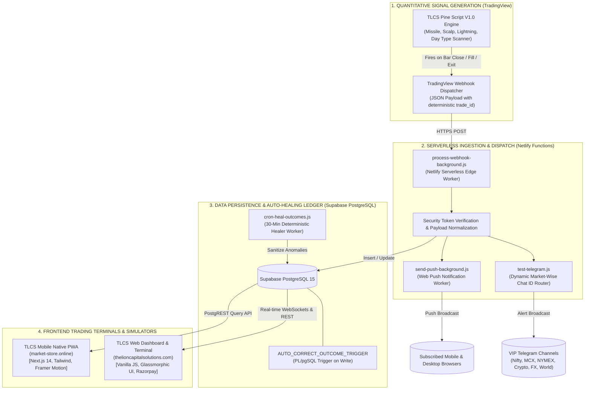
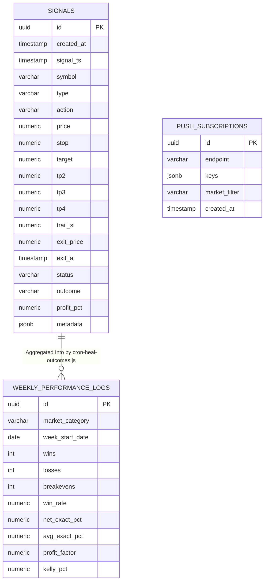

# THE LION CAPITAL SOLUTIONS (TLCS)
## Enterprise System Architecture, Algorithmic Engine Specification & Intellectual Property Ownership Blueprint
**Document Classification:** Proprietary & Confidential Technical Whitepaper & Legal Ownership Booklet  
**Version:** 1.0.0 (Production Master Release)  
**Effective Date:** September 1, 2026  
**Author & Sole Intellectual Property Owner:** Vishant (The Lion Capital Solutions / The Lion Capital Advisors)  
**System Production Domains:** `thelioncapitalsolutions.com` | `market-store.online`  

---

```
  ████████╗██╗      ██████╗███████╗    ████████╗███████╗██████╗ ███╗   ███╗██╗███╗   ██╗ █████╗ ██╗     
  ╚══██╔══╝██║     ██╔════╝██╔════╝    ╚══██╔══╝██╔════╝██╔══██╗████╗ ████║██║████╗  ██║██╔══██╗██║     
     ██║   ██║     ██║     ███████╗       ██║   █████╗  ██████╔╝██╔████╔██║██║██╔██╗ ██║███████║██║     
     ██║   ██║     ██║     ╚════██║       ██║   ██╔══╝  ██╔══██╗██║╚██╔╝██║██║██║╚██╗██║██╔══██║██║     
     ██║   ███████╗╚██████╗███████║       ██║   ███████╗██║  ██║██║ ╚═╝ ██║██║██║ ╚████║██║  ██║███████╗
     ╚═╝   ╚══════╝ ╚═════╝╚══════╝       ╚═╝   ╚══════╝╚═╝  ╚═╝╚═╝     ╚═╝╚═╝╚═╝  ╚═══╝╚═╝  ╚═╝╚══════╝
```

---

## TABLE OF CONTENTS
1. [Legal Declaration of Intellectual Property & Ownership](#1-legal-declaration-of-intellectual-property--ownership)
2. [Executive Summary & System Utility](#2-executive-summary--system-utility)
3. [End-to-End System Architecture Overview](#3-end-to-end-system-architecture-overview)
4. [Proprietary Pine Script Trading Engine & Algorithmic Models](#4-proprietary-pine-script-trading-engine--algorithmic-models)
5. [Deterministic Trade Lifecycle & Anti-Ghost Execution Engine](#5-deterministic-trade-lifecycle--anti-ghost-execution-engine)
6. [Single Source of Truth: Exact Mathematical Engine & Self-Healing Triggers](#6-single-source-of-truth-exact-mathematical-engine--self-healing-triggers)
7. [Cloud Infrastructure, Netlify Microservices & Database Topology](#7-cloud-infrastructure-netlify-microservices--database-topology)
8. [Multi-Market Dynamic Notification & Telegram Routing System](#8-multi-market-dynamic-notification--telegram-routing-system)
9. [Web Trading Terminal & Screener Architecture (`TLCS_Website_Deploy`)](#9-web-trading-terminal--screener-architecture-tlcs_website_deploy)
10. [Mobile Native Progressive Web App Architecture (`Tv-Alert-Mobile`)](#10-mobile-native-progressive-web-app-architecture-tv-alert-mobile)
11. [Virtual Paper Portfolio & Multi-Asset Lot-Size Simulator](#11-virtual-paper-portfolio--multi-asset-lot-size-simulator)
12. [Complete User Journey & Operational Walkthrough](#12-complete-user-journey--operational-walkthrough)
13. [Security Architecture, Licensing & Cryptographic Protection](#13-security-architecture-licensing--cryptographic-protection)
14. [Sign-Off, Versioning & Legal Ratification](#14-sign-off-versioning--legal-ratification)

---

# 1. LEGAL DECLARATION OF INTELLECTUAL PROPERTY & OWNERSHIP

### 1.1 Proprietary Ownership Statement
This document, together with all associated source code, algorithms, visual interfaces, mathematical formulas, Pine Script indicator scripts, serverless background workers, webhooks, database schemas, and documentation comprising **The Lion Capital Solutions (TLCS)** trading platform, is the sole, exclusive, and unencumbered Intellectual Property (IP) of **Vishant** (operating as *The Lion Capital Solutions* / *The Lion Capital Advisors*).

### 1.2 Protected Intellectual Properties & Trade Secrets
The following novel technologies, mathematical mechanisms, and software architectures are strictly proprietary trade secrets and confidential assets:
1. **The Darth Maul Intra-Candle Safeguard Algorithm**: Novel candle-close barrier validation preventing erroneous stop outs during violent wick rejections after Take Profit 1 (TP1) target fulfillment.
2. **The Rigid Step-Level Trailing Stop Loss Mechanism**: Dynamic trailing stop state engine eliminating continuous floating noise by locking stops definitively to Breakeven (B/E), TP1, TP2, TP3, or Exponential Moving Average (EMA) boundaries.
3. **The Deterministic Bar-Time Trade Identification Binding (`trade_id`)**: Timestamp synchronization architecture binding TradingView bar times directly to Supabase relational records, guaranteeing zero state collisions across asynchronous serverless webhook executions.
4. **The Exact Percentage Mathematical Engine (`exact_pct`)**: Deprecation of third-party percentage and R-multiple estimations in favor of server-side deterministic mathematical evaluation `((Exit - Entry) / Entry) * 100` coupled with PostgreSQL trigger auto-healing.
5. **The TLCS Screener Matrix & Day Type Blueprint Categorization**: Proprietary mathematical identification of market auction distributions (Rejection Blueprint, Absorption Blueprint, Failed New Low/High Blueprint, Outside Day, Stop Run Day).
6. **The Multi-Asset Virtual Paper Trading Simulator**: Zero-latency mathematical simulator featuring real-time expectancy modeling, half-Kelly criterion calculation, and peak-to-trough Calmar ratio risk engines.

### 1.3 Copyright & Trade Secret Notice
```
Copyright © 2024–2026 Vishant (The Lion Capital Solutions). All Rights Reserved.
No part of this software, architecture, design system, algorithm, or documentation may be
reproduced, decompiled, reverse-engineered, distributed, sublicensed, or transmitted in any form
or by any means without the express prior written authorization of the copyright owner.
```

---

# 2. EXECUTIVE SUMMARY & SYSTEM UTILITY

### 2.1 Mission & Vision
**The Lion Capital Solutions (TLCS)** is an enterprise-grade, institutional-caliber quantitative algorithmic trading and market intelligence ecosystem. The system bridges the gap between sophisticated technical analysis on TradingView and institutional risk execution, delivering real-time signals, rigorous risk-to-reward analytics, automated trade tracking, multi-market Telegram alerts, and interactive simulation across six major global asset classes:
1. **Domestic Equities & Index Derivatives** (NIFTY 50, Bank Nifty, Indian Equities)
2. **Domestic Commodities** (MCX Crude Oil, Gold, Silver, Natural Gas, Base Metals)
3. **International Energy & Precious Metals** (NYMEX WTI Crude, COMEX Gold, Silver, Gas)
4. **Cryptocurrency Derivatives** (Top 25 Liquid Cryptocurrencies vs. USDT)
5. **Global Foreign Exchange** (Major, Minor, and INR Currency Pairs)
6. **Global World Indices** (US30, NAS100, SPX500, DAX40, FTSE100, Nikkei 225)

### 2.2 System Utility for the Reader
To an institutional trader, prop desk manager, retail investor, or technical auditor, TLCS delivers:
- **Zero-Latency Signal Dissemination**: Millisecond-level trade generation from TradingView charts directly to subscribers via Web Push, Telegram VIP channels, and Web/Mobile terminals.
- **100% Empirical Truth in Performance**: Elimination of repainting, selective cherry-picking, and inflated win rates through immutable Supabase ledger persistence and rigorous `exact_pct` accounting.
- **Multi-Theme Glassmorphic User Experience**: High-density, professional visual interface optimized for extreme market clarity in Light, Pitch Dark, and Slate Gray environments.
- **Risk-Adjusted Portfolio Sizing**: Automated position sizing, contract unit scaling, and Kelly betting optimizations embedded directly into every trade log.

---

# 3. END-TO-END SYSTEM ARCHITECTURE OVERVIEW



---

# 4. PROPRIETARY PINE SCRIPT TRADING ENGINE & ALGORITHMIC MODELS

The core quantitative edge of TLCS resides in its proprietary TradingView Pine Script v5 engine (`TLCS All Signal Alerts`). The engine operates strictly without repainting, utilizing verified bar-close logic and precise intra-candle state tracking.

### 4.1 Proprietary Signal Strategies
1. **TLCS Missile Strategy**: High-momentum directional trend-following model identifying aggressive institutional order flow breakouts through structural balance ranges.
2. **TLCS Scalp Strategy**: Mean-reversion intraday liquidity capture strategy targeting quick exhaustion wicks at Volume Weighted Average Price (VWAP) and Pivot standard deviation bands.
3. **TLCS Lightning Strategy**: Ultra-rapid breakout continuation engine executed during high-velocity volatility expansions (Opening Range Breakouts and News Momentum).
4. **TLCS Divergence Strategy**: Advanced RSI and Momentum Oscillator structural divergence detector isolating institutional accumulation and distribution inflection points.

### 4.2 The Darth Maul Rule (Intra-Candle Reversal Safeguard)
A frequent point of failure in automated systems is the "Darth Maul" phenomenon: a high-volatility candle wicks upward to fill Take Profit 1 (TP1), automatically triggering the stop loss to move to Breakeven (B/E), but violently reverses within the *same candle* to close below breakeven, resulting in an ambiguous fill state in standard backtesters.

**The TLCS Mathematical Resolution:**
$$\text{If } \text{TP1 Hit in Bar } t \implies \text{SL moved to Entry Price (B/E)}$$
$$\text{Exit Condition: } \text{Candle Close}_t \le \text{B/E Price} \quad (\text{Evaluated strictly on Close, never on intra-bar Low wick})$$
This guarantees that noisy wicks cannot prematurely disqualify the position while ensuring complete capital protection if the bar legitimately closes below the breakeven barrier.

### 4.3 Late Fill & EOD Trailing Exit (TP1 Force Rule)
Limit orders filled within the final 2 hours of regular market trading:
$$T_{\text{close}} - T_{\text{current}} \le 7,200,000\text{ ms (2 Hours)}$$
are automatically categorized as **Late Fills**. Late Fills forcefully close 100% of the position at TP1 and unconditionally disable overnight trailing mechanisms to eliminate overnight gap vulnerability.

---

# 5. DETERMINISTIC TRADE LIFECYCLE & ANTI-GHOST EXECUTION ENGINE

TLCS utilizes a rigid four-state deterministic finite state machine (FSM) to manage trade lifecycles across distributed systems without generating "ghost" signals or phantom executions.

```
       [ TradingView Alert ]
                 │
                 ▼
      ┌─────────────────────┐
      │    ACTIVE LIMIT     │  (Pending Limit Order; No Telegram alert sent)
      └──────────┬──────────┘
                 │
        ┌────────┴────────┐
        │  Limit Filled?  │
        └────────┬────────┘
                 │
     ┌───────────┴───────────┐
     ▼                       ▼
[ YES: TradeFill ]     [ NO: Cancel/Expire ]
     │                       │
     ▼                       ▼
┌──────────────┐       ┌───────────┐
│ LIVE ACTIVE  │       │ CANCELLED │
└──────┬───────┘       └───────────┘
       │
       ├─────────────────────────────────┐
       ▼                                 ▼
┌───────────────┐               ┌─────────────────┐
│ TrailingSL    │               │   TradeClose    │
│ Update Alert  │               │ (TP / SL Exit)  │
└───────────────┘               └────────┬────────┘
                                         │
                                         ▼
                                ┌─────────────────┐
                                │ CLOSED (WIN/LS) │
                                └─────────────────┘
```

### 5.1 Deterministic Unique `trade_id` Generation
To eliminate state desynchronization between TradingView bar evaluations and Supabase asynchronous writes, Pine Script constructs a deterministic composite key:
$$\text{trade\_id} = \text{syminfo.ticker} + \text{"\_"} + \text{str.tostring}(\text{trade.signalTime}) + \text{"\_"} + \text{trade.tradeDirection}$$
- `trade.signalTime` is locked strictly to the bar opening timestamp (`time`), **NEVER** the non-deterministic realtime clock (`timenow`).
- The backend matches subsequent `TradeFill`, `TrailingSLUpdate`, and `TradeClose` webhooks against this exact immutable `trade_id`.

---

# 6. SINGLE SOURCE OF TRUTH: EXACT MATHEMATICAL ENGINE & SELF-HEALING TRIGGERS

### 6.1 The Exact Percentage Formula (`exact_pct`)
Legacy TradingView alerts often report inaccurate percentage returns due to fixed tick assumptions. TLCS globally enforces the exact mathematical percentage as the **Single Source of Truth**:

$$\text{exact\_pct} = \begin{cases} 
\left( \frac{\text{Exit Price} - \text{Entry Price}}{\text{Entry Price}} \right) \times 100 & \text{for LONG / BUY} \\[8pt]
\left( \frac{\text{Entry Price} - \text{Exit Price}}{\text{Entry Price}} \right) \times 100 & \text{for SHORT / SELL}
\end{cases}$$

### 6.2 The Canonical `resolveOutcome` Algorithm
The single, canonical outcome resolution logic deployed uniformly across `trade-metrics.js`, `scanner.js`, `dashboard.html`, and `page.tsx`:

```javascript
function resolveOutcome(s) {
    if (!s) return 'OPEN';
    const st = (s.status  || '').toUpperCase();
    const o  = (s.outcome || '').toUpperCase();
    
    // Step 1: exact_pct is the SINGLE SOURCE OF TRUTH — evaluated first
    let meta = s.metadata || {};
    if (typeof meta === 'string') { try { meta = JSON.parse(meta); } catch(e) { meta = {}; } }
    if (meta.exact_pct != null) {
        const pct = parseFloat(meta.exact_pct);
        if (!isNaN(pct)) {
            if (pct > 0)  return 'WIN';
            if (pct < 0)  return 'LOSS';
            return 'BREAKEVEN';
        }
    }

    // Step 2: Hard-kill CANCELLED/UNKNOWN
    if (o.includes('CANCEL') || st.includes('CANCEL') || st.includes('UNKNOWN') || o.includes('UNKNOWN')) return 'CANCELLED';
    if ((st.includes('EXPIRED') || st.includes('COMPLETED')) && !s.exit_price) return 'CANCELLED';

    // Step 3: Granular keyword fallbacks (only when exact_pct is genuinely absent)
    if (st.includes('ACTIVE') || o === 'OPEN' || st === 'OPEN') return 'OPEN';
    if (o === 'WIN'  || st.includes('WIN'))  return 'WIN';
    if (o === 'LOSS' || st.includes('LOSS')) return 'LOSS';
    if ((st.includes('STOP') || st.includes('SL')) && !st.includes('TRAIL')) return 'LOSS';
    return 'OPEN';
}
```

### 6.3 Canonical Win Rate & Statistical Formulas
All performance matrices adhere strictly to institutional statistical definitions:
- **Canonical Win Rate**:
  $$\text{Win Rate (\%)} = \left( \frac{N_{\text{Wins}}}{N_{\text{Wins}} + N_{\text{Losses}} + N_{\text{Breakevens}}} \right) \times 100$$
  *(Note: Breakeven trades are strictly retained in the denominator to prevent artificial win-rate inflation).*
- **Profit Factor (PF)**:
  $$\text{Profit Factor} = \frac{\sum \text{exact\_pct}_{\text{Gains}}}{\left| \sum \text{exact\_pct}_{\text{Losses}} \right|}$$
- **Half-Kelly Criterion**:
  $$K_{1/2} = \frac{1}{2} \times \left( W - \frac{1 - W}{R} \right) \times 100$$
  *where $W = \text{Win Rate Decimal}$, $R = \text{Avg Win \%} / \text{Avg Loss \%}$.*
- **Calmar Ratio**:
  $$\text{Calmar Ratio} = \frac{\text{Total Cumulative Net Return (\%)}}{\text{Peak-to-Trough Maximum Drawdown (\%) [Max DD]}}$$

---

# 7. CLOUD INFRASTRUCTURE, NETLIFY MICROSERVICES & DATABASE TOPOLOGY

### 7.1 Pure Netlify Serverless Architecture
TLCS operates on a single-infrastructure model hosted exclusively on **Netlify Enterprise Infrastructure**:
- **Zero Vercel Deployments**: The platform maintains 100% decoupling from third-party hosting dependencies.
- **Background Workers**: Long-running background dispatchers (`process-webhook-background.js`, `send-push-background.js`) utilize Netlify's asynchronous background execution model to return instant `202 Accepted` HTTP status codes to TradingView, completely preventing timeout delivery failures.

### 7.2 Database Schema Topology (Supabase / PostgreSQL)



---

# 8. MULTI-MARKET DYNAMIC NOTIFICATION & TELEGRAM ROUTING SYSTEM

```
                             [ INCOMING TRADE EVENT ]
                                        │
                                        ▼
                           [ Market Category Resolver ]
                                        │
     ┌──────────┬──────────┬────────────┼────────────┬──────────┬──────────┐
     ▼          ▼          ▼            ▼            ▼          ▼          ▼
  [ NIFTY ]  [ MCX ]   [ NYMEX ]    [ CRYPTO ]    [ FOREX ]  [ WORLD ]  [ ALL ]
     │          │          │            │            │          │          │
     ▼          ▼          ▼            ▼            ▼          ▼          ▼
  Telegram   Telegram   Telegram     Telegram     Telegram   Telegram   Web Push
  NIFTY VIP  MCX VIP    NYMEX VIP    CRYPTO VIP   FX VIP     WORLD VIP  All Devices
```

### 8.1 Market Routing Engine
The backend normalizes symbols by stripping exchange prefixes (`NSE:`, `TVC:`, `BINANCE:`) and continuous contract suffixes (`1!`), routing alerts dynamically to dedicated Telegram channels via environment lookup:
- Domestic Equities: `TELEGRAM_CHAT_ID_NIFTY`
- Commodities: `TELEGRAM_CHAT_ID_MCX`
- Energy & Metals: `TELEGRAM_CHAT_ID_NYMEX`
- Cryptocurrencies: `TELEGRAM_CHAT_ID_CRYPTO`
- Global FX: `TELEGRAM_CHAT_ID_FOREX`
- World Indices: `TELEGRAM_CHAT_ID_WORLD`

### 8.2 Execution-Only Filter Policy
Telegram notifications **NEVER** trigger for unexecuted pending limit orders (`ACTIVE LIMIT` / `OPEN`). Notifications trigger **ONLY** upon:
1. `⚡ TRADE ACTIVE`: Confirmed limit fill and live position entry.
2. `🎯 TARGET HIT`: Partial target achievement (TP1, TP2, TP3, TP4).
3. `🛡️ TRAILING SL MOVED`: Trailing stop adjustment locking in profits.
4. `🛑 TRADE CLOSED`: Final trade closure with exact realized percentage and P&L.

---

# 9. WEB TRADING TERMINAL & SCREENER ARCHITECTURE (`TLCS_Website_Deploy`)

The web dashboard (`thelioncapitalsolutions.com`) is a high-speed, lightweight, responsive analytics terminal engineered in vanilla JavaScript, HTML5, and CSS3.

### 9.1 Core Modules & Pages
- **AI Dashboard (`index.html`)**: Real-time signal monitor, multi-market cards, active trade tracker with live target-flipping dynamic badges, and 0-Hrs strict local day performance summary.
- **AI Scanner (`scanner.html` / `scanner.js`)**: Real-time 7-day Day Type Blueprint scanner aggregating institutional volume auction patterns.
- **Commodity Scanner (`commodity-scanner.html` / `commodity-scanner.js`)**: Dedicated commodity terminal tracking MCX & NYMEX contract spreads and directional blueprints.
- **AI Research & Analytics (`metrics.html` / `strategy_tearsheet.html`)**: Interactive QuantStats statistical tearsheet displaying equity curves, drawdown underwater plots, monthly heatmaps, and Rolling Sharpe ratios.
- **Dynamic Localization & Gateways**: Geo-IP localization serving seamless Razorpay payment flows for domestic INR users and Stripe/PayPal for international USD subscribers.

---

# 10. MOBILE NATIVE PROGRESSIVE WEB APP ARCHITECTURE (`Tv-Alert-Mobile`)

The mobile application (`market-store.online`) is an advanced Progressive Web App (PWA) built on **Next.js 14 (App Router)**, **React 18**, **Tailwind CSS**, and **Framer Motion**.

### 10.1 Multi-Theme Engine & Glassmorphism
The UI implements an ultra-crisp frosted glass design system supporting three distinct visual environments:
1. **Light Frosted Theme**: Translucent frosted white glass (`bg-white/70 backdrop-blur-md`) with high-contrast slate text (`text-slate-900`, `text-slate-700`).
2. **Pitch Dark Theme**: Deep space glass (`dark:bg-slate-900/60 dark:border-white/10`) with glowing emerald, cyan, and amber status indicators.
3. **Slate Gray Theme**: Professional low-eyestrain medium charcoal glass (`theme-gray:bg-slate-200/60`) for extended trading sessions.

### 10.2 Mobile Navigation Structure (The 6 Pillars)
1. **HUB (`DASHBOARD`)**: Global executive summary, active trade pills, win-rate meters, and Novice/Pro mode risk guides.
2. **LOGS (`ALERTS`)**: Chronological audit trail of all executed trades, exit timestamps, exact return percentages, and duration metrics.
3. **MARKETS (`ANALYSIS`)**: Asset-class breakdown displaying performance metrics across all 6 market segments.
4. **INSIGHTS (`INSIGHTS`)**: Strategy performance matrix breaking down Missile, Scalp, Lightning, and Divergence models.
5. **ANALYTICS (`ANALYTICS`)**: Weekly Performance Edge ledger, 1-day Parameter Matrix, 7-day Target Achievement tables, and interactive tearsheets.
6. **SCREENER (`SCREENER`)**: TLCS Screener Matrix and the Virtual Paper Portfolio Simulator.

---

# 11. VIRTUAL PAPER PORTFOLIO & MULTI-ASSET LOT-SIZE SIMULATOR

Embedded in the **SCREENER** tab, the Virtual Paper Portfolio enables zero-risk forward testing and institutional capital simulations.

```
┌────────────────────────────────────────────────────────────────────────┐
│                        VIRTUAL PAPER PORTFOLIO                         │
│       Lot-Sizing & Point Movement Paper Trading Simulator (1 Lot)       │
├────────────────────────────────────────────────────────────────────────┤
│  [ 📈 NIFTY 50 ]       [ 🛢️ NYMEX & COMEX ]      [ ₿ CRYPTO TOP 25 ]  │
│  [ 💱 FOREX PAIRS ]    [ 🌍 WORLD INDICES ]      [ 🌐 ALL MARKETS ]   │
├────────────────────────────────────────────────────────────────────────┤
│  Virtual Capital: ₹10,00,000      Position Sizing: 1 Lot (Fixed)       │
│  Quantity: 65 Qty (NIFTY) / 100 Sh (Stocks) / 1 Lot (NYMEX/World)       │
├────────────────────────────────────────────────────────────────────────┤
│  ┌──────────────────┐  ┌──────────────────┐  ┌──────────────────────┐  │
│  │ VIRTUAL NET WORTH│  │ REALIZED PAPER PL│  │  SIMULATED WIN RATE  │  │
│  │ ₹10,48,250       │  │ +₹48,250         │  │  68.4% (PF: 2.45)    │  │
│  │ +4.82% ROI       │  │ 19 Closed Trades │  │  13W / 6L / 0BE      │  │
│  └──────────────────┘  └──────────────────┘  └──────────────────────┘  │
│  ┌──────────────────┐  ┌──────────────────┐  ┌──────────────────────┐  │
│  │ PAPER EXPECTANCY │  │   CALMAR RATIO   │  │   AVG WIN / LOSS     │  │
│  │ +1.82R           │  │   3.85           │  │   +₹5,200            │  │
│  │ +₹2,539 / trade  │  │   Max DD: 1.25%  │  │   -₹2,100            │  │
│  └──────────────────┘  └──────────────────┘  └──────────────────────┘  │
└────────────────────────────────────────────────────────────────────────┘
```

### 11.1 Asset Lot Sizing & Value Calculations
- **NIFTY 50 Index**: 1 Lot = 65 Units (`Points × 65 × ₹1`).
- **Indian Equities**: 1 Lot = 100 Shares (`Points × 100 × ₹1`).
- **MCX Crude Oil / Metals**: 1 Lot = 100 Units (`Points × 100 × ₹1`).
- **NYMEX & COMEX**: 1 Lot = 1 Contract (`1.00 Point = $1.00 USD`).
- **Crypto Top 25**: 1 Lot = 1 Unit (`Price Delta × 1.0`).
- **Global Forex**: 1 Lot = 10,000 Units (Mini Lot).
- **World Indices**: 1 Lot = 1 Contract (`Index Points × $1.00`).

---

# 12. COMPLETE USER JOURNEY & OPERATIONAL WALKTHROUGH

### Phase 1: Onboarding & Subscription
1. User visits `thelioncapitalsolutions.com` or `market-store.online`.
2. Selects subscription tier via geo-localized payment gateway (Razorpay for INR, Stripe for USD).
3. Receives instant activation token, Telegram VIP channel access links, and Web Push subscription prompt.

### Phase 2: Live Market Signal Consumption
1. Institutional setup triggers in TradingView Pine Script engine.
2. Webhook dispatches to Netlify background processor within 50ms.
3. User receives simultaneous Telegram notification and Web Push alert detailing Entry, Stop Loss, TP1, TP2, TP3, TP4, and Strategy Name.
4. User opens **HUB** tab on mobile terminal to monitor active trade progression.

### Phase 3: Dynamic Trade Management
1. When price reaches TP1, stop loss moves automatically to Breakeven.
2. User receives a Telegram `🎯 TARGET HIT` and `🛡️ TRAILING SL` notification.
3. Mobile terminal trade pill flips from amber target badge to green realized gain pill.
4. Upon exit closure, exact percentage return is permanently calculated and committed to the Supabase master ledger.

### Phase 4: Strategy Optimization & Paper Simulation
1. User navigates to **SCREENER** tab and opens the **Virtual Paper Portfolio**.
2. Selects market segment (e.g., `NYMEX & COMEX` or `NIFTY 50`).
3. Evaluates real-time Net Realized P&L, Expectancy R-multiples, and Calmar ratios.
4. Explores **ANALYTICS** tab to review weekly performance edge distributions and strategy tearsheets.

---

# 13. SECURITY ARCHITECTURE, LICENSING & CRYPTOGRAPHIC PROTECTION

1. **API Token Cryptographic Authentication**: All TradingView webhook payloads must supply a valid `api_key` matching internal environment secrets (`SUPABASE_SERVICE_ROLE_KEY`, `WEBHOOK_AUTH_TOKEN`). Unauthenticated payloads are immediately dropped with `401 Unauthorized`.
2. **Row Level Security (RLS)**: Supabase PostgreSQL database tables implement strict Row Level Security policies. Client-side PostgREST queries operate via read-only anonymous keys, preventing unauthorized schema writes or table mutations.
3. **Defensive Sanitization**: All incoming payload dates, numbers, and string values are sanitized through runtime type validators, eliminating SQL injection, XSS vectors, and `Invalid Date` runtime crashes.

---

# 14. SIGN-OFF, VERSIONING & LEGAL RATIFICATION

This master technical document stands as the definitive system architecture specification and intellectual property record of **The Lion Capital Solutions (TLCS)**.

| Attribute | Specification |
| :--- | :--- |
| **System Name** | The Lion Capital Solutions (TLCS) Platform |
| **Current Production Version** | `v1.0.0` / `v1.0` |
| **Git Release Tag** | `v1.0` / `v1.0.0` (`thelioncapital-alerts`, `RemoteURL`, `TLCS_Website`) |
| **Primary Authorship** | Vishant |
| **Legal Entity** | The Lion Capital Solutions / The Lion Capital Advisors |
| **Effective Date** | September 1, 2026 |
| **Hosting Infrastructure** | Netlify Enterprise Servers & Supabase Cloud PostgreSQL |
| **Production Domains** | `https://thelioncapitalsolutions.com` \| `https://market-store.online` |

```
IN WITNESS WHEREOF, this technical specification and intellectual property booklet is ratified
and established as the proprietary technology and single source of truth for all TLCS software systems.
```
